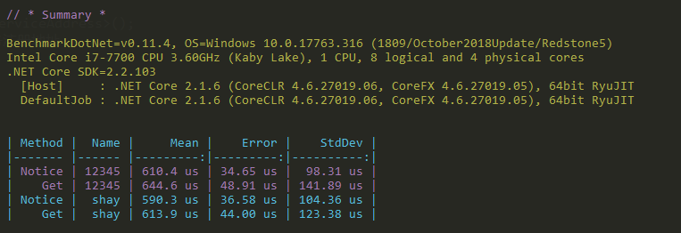

# spear
Spear轻量级微服务框架，高扩展性，目前已支持TCP、HTTP协议，采用Consul作为服务注册与发现组件，TCP协议采用DotNetty底层实现，HTTP协议采用ASP.NET CORE MVC实现。

| Package Name |  NuGet | Downloads | |
|--------------|  ------- |  ---- | -- |
| Spear.ProxyGenerator | [](https://www.nuget.org/packages/Spear.ProxyGenerator) | [](https://www.nuget.org/stats/packages/Spear.ProxyGenerator?groupby=Version) |
| Spear.Core | [](https://www.nuget.org/packages/Spear.Core) | [](https://www.nuget.org/stats/packages/Spear.Core?groupby=Version) | [Wiki](https://github.com/shoy160/spear/wiki) |
| Spear.Consul | [](https://www.nuget.org/packages/Spear.Consul) | [](https://www.nuget.org/stats/packages/Spear.Consul?groupby=Version) |
| Spear.Protocol.Http | [](https://www.nuget.org/packages/Spear.Protocol.Http) | [](https://www.nuget.org/stats/packages/Spear.Protocol.Http?groupby=Version) |
| Spear.Protocol.Tcp | [](https://www.nuget.org/packages/Spear.Protocol.Tcp) | [](https://www.nuget.org/stats/packages/Spear.Protocol.Tcp?groupby=Version) |

### Contracts
``` c#
[ServiceRoute("test")] //自定义路由键
public interface ITestContract : ISpearService
{
    Task Notice(string name);
    Task<string> Get(string name);
}
```
### Server
``` c#
var services = new MicroBuilder();
//服务协议
var protocol = ServiceProtocol.Tcp;
services.AddMicroService(builder =>
{
    //服务端需指定编解码器和使用协议
    builder
        .AddJsonCoder()             //Json编解码
        //.AddMessagePackCodec()    //MessagePack
        //.AddProtoBufCodec()       //ProtoBuf
        .AddSession()
        //.AddNacos()
        .AddConsul("http://127.0.0.1:8500"); //Consul服务注册与发现
    switch (protocol)
    {
        case ServiceProtocol.Tcp:
            builder.AddTcpProtocol();       //TCP
            break;
        case ServiceProtocol.Http:
            builder.AddHttpProtocol();      //Http
            break;
        case ServiceProtocol.Ws:
            builder.AddWebSocketProtocol(); //WebSocket
            break;
        case ServiceProtocol.Grpc:
            builder.AddGrpcProtocol();      //GRpc
            break;
    }
});

services.AddTransient<ITestContract, TestService>();

var provider = services.BuildServiceProvider();

provider.UseMicroService(address =>
{
    address.Service = "192.168.1.xx";   //服务注册地址,需要保持与客户端的网络访问
    address.Host = "localhost";         //主机地址
    address.Port = 5001;                //端口地址
    address.Weight = m.Weight;          //服务权重
    address.Gzip = true;                //是否启用GZip压缩
});
```

### Client
``` c#
var services = new MicroBuilder()
    .AddMicroClient(builder =>
    {
        //支持多编解码&多协议
        builder
            .AddJsonCodec()
            .AddMessagePackCodec()
            .AddProtoBufCodec()
            .AddHttpProtocol()          //Http
            .AddTcpProtocol()           //TCP
            .AddWebSocketProtocol()     //WebSocket
            .AddGrpcProtocol()          //GRpc
            .AddSession()
            //.AddNacos()
            .AddConsul("http://127.0.0.1:8500");
    });
var provider = services.BuildServiceProvider();
var proxy = provider.GetService<IProxyFactory>();
var service = proxy.Create<ITestContract>();
```

### BenchMark

